# [AI Notes](https://github.com/quickgrid/AI-Resources/blob/master/ai-notes.md)

Notes from reading various deep learning, computer vision etc. papers. 

Many of the text are copied from paper as is and others with some modifications. Figures are from paper. Highlighted portions should be read and only some of the highlighted parts are expanded as notes.

**WARNING:** These notes may contain errors due to misinterpretation, lack of understanding, missing details etc. 

### TODO

- [ ] Organize notes such that everything can be found easily for implementation.

# StyleGAN Family

Recommend skimming all of the papers except Style GAN 2 ADA (optional) to get an overall understanding.

# [ProGAN](https://arxiv.org/abs/1710.10196)

**Status: Mostly complete.**

Key idea is growing both Generator `G`, Discriminator `D` progressively. Starting from easier low-resolution images, and add new layers that introduce higher-resolution details as the training progresses.

This incremental nature allows the training to first discover large-scale structure of the image distribution and then shift attention to increasingly finer scale detail, instead of having to learn all scales simultaneously.

It is shown on figure 4 that earlier layers take less time to train. With progressive growing the existing low-resolution layers are likely to have already converged early on,
so the networks are only tasked with refining the representations by increasingly smaller-scale effects as new layers are introduced. Without progressive growing, all layers of the generator and discriminator are tasked with simultaneously finding succinct intermediate representations for both the large-scale variation and the small-scale detail. 

### Background

Generative methods that produce novel samples from high-dimensional data distributions. They include,

- Auto regressive models such as PixelCNN produces sharp result but slow and do not have latent representation. 
- VAE are easy to train but produces blurry results.
- GANs produce sharp images at low resolution with limited variation.

A GAN consists of two networks: `generator` and `discriminator (aka critic)`. The generator produces a sample, such as an image, from a latent code. The distribution of these generated samples such as images should ideally be indistinguishable from the training distribution. A discriminator is trained to do this assesment. Since both networks are differentiable, gradient is used to steer both networks to the right direction.

High resolution image generation is difficult because it easier to distinguish generated samples from real. Also larger samples require using smaller minibatches due to memory cosideration further compromising training quality. 

Several ways were proposed by others to measure degrees of variation in generative model such as, `Multi-Scale Structural Similarity (MS-SSIM)`, `Inception Score (IS)`.

### Evaluation Metric

MS-SSIM is able to find large-scale `mode collapses` reliably but fail to react to smaller effects such as loss of variation in colors or textures, and they also do not directly assess image quality in terms of similarity to the training set.

Patches are extracted based on section 5 for which statistical similarity is measured by computing their `sliced Wasserstein distance (SWD)`. 

A small Wasserstein distance indicates that the distribution of the patches is similar, meaning that the training images and generator samples appear similar in both appearance and variation at this spatial resolution. The distance between the patch sets extracted from the lowest resolution images indicate similarity in large-scale image structures.

## Network Structure

## Progressive Growing

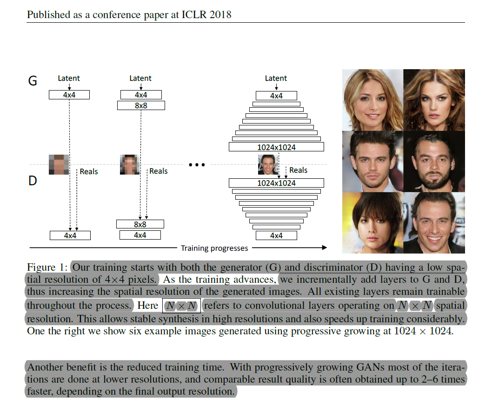

## Layer Fading

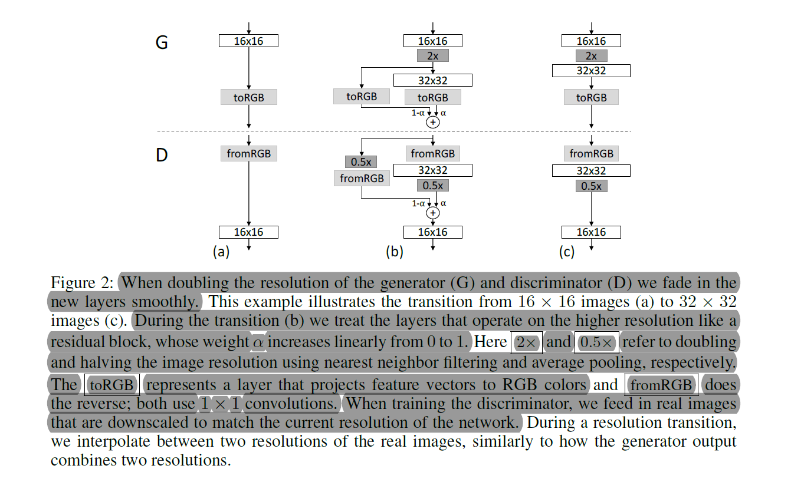

## Implementation Details

All layers of both network remain trainable throught training process and newly added layers are fade in smoothly. Both G and D are mirrors of each other and grow in synchrony.

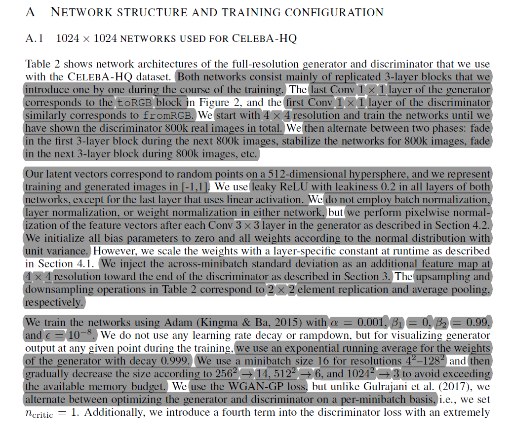

### Network Details

As shown in above diagram the 3 layer blocks are repeated multiple time for both network. For G it is `(upsample, conv, conv)` and for D it is `(conv, conv, downsample)`. This will be block that is reused in code to generate the repeated layers.

The last conv block is `toRGB` in generator. Uses `1x1` convolution to map feature map to 3 channels for RGB image. Similarly for discriminator the first block with `1x1` convolution is `fromRGB` which takes an RGB 3-channel image and maps to desired feature map size.

Upsampling uses `2x2` replication and downsampling is `2x2` average pooling. As shown in table 2 all layers use leaky relu with negative slope of `0.2` except last layer using linear activation.

No batch, layer, weight norm is used but after each `3x3` conv layer in `G` pixel norm is used.

#### Pixelwise Normalization

Pixelwise feature vector normalization aka `pixel norm` is applied in generator after each conv layer to prevent `G` and `D` magnitute spiral out of control. Each pixel in channel/feature map dimension is normalized using simple formula in section 4.2.

### Training Details

G and D optimization is alternate on per minibatch basis.

Training start with `4x4` resolution. Latent vector `z` is 512 dimensional and images are normalized to `[-1, 1]`. 

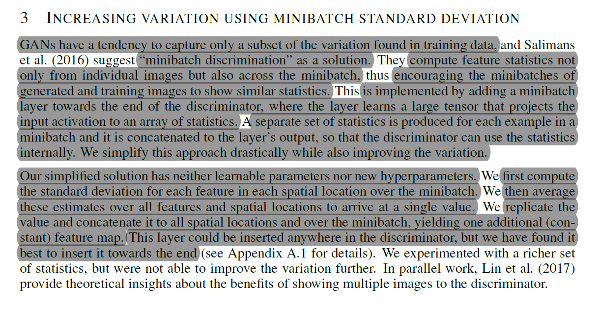

### Loss Function

WGAN-GP.

### Weight Initialization

Weight initialization is performed with bias set to 0 and all weights from normal distribution with unit variance. Weights are initialized based on `he/kaiming initializer`. For pytorch it is `kaiming_normal_`. 

## Dataset Generation (Optional)

In this paper a higher quality version 1024x1024 CelebA dataset with 30000 images is used.

To improve the overall image quality, JPEG images were processed with two pre-trained neural networks: a convolutional autoencoder trained to remove JPEG artifacts in natural images and an adversarially-trained 4x super-resolution network. 

Based on face landmarks a rotated bounding box is selected and it is then orientated, cropped to generate training image.

# [StyleGAN](https://arxiv.org/abs/1812.04948)

An `alternate generator structure` is proposed that leads unsupervised separation of high level attributes such as pose, identity for faces, `stochastic variation` such as freckles, hair etc. The `discriminator, loss function stays same` from previous work.

New generator `starts from a learned constant input` and adjusts the `style` of the image at each convolution layer based on the latent code, therefore directly controlling the strength of image features at different scales.

The input latent space must follow the probability density of the training data. It is said that this leads to some degree of unavoidable entanglement. To overcome this generator embeds latent code into intermediate space. This intermediate space is free from restriction thus allowed to be disentangled.

For quantifying the amount of disentanglement in latent space `Perceptual Path Length` and `Linear Separability` is proposed to quantify these aspects in generator.

It is shown that new generator gets more linear, less entangled representation of different factors of variation than previous. Also a high quality human faces dataset `FFHQ` is proposed.

## Implementation Details

### ProGAN vs StyleGAN Generator

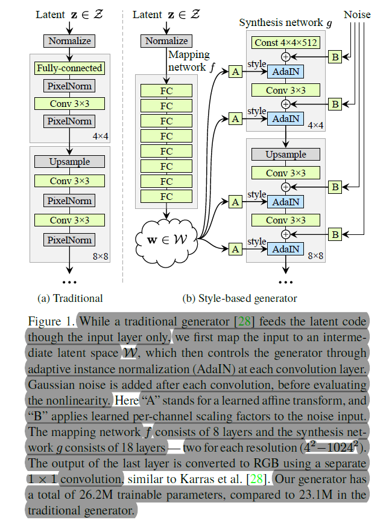

Previously latent code was provided to generator via input layer. This time the generator is made up of `two sub networks`. One is `Mapping Network` another is `Synthesis Network`. 

Previous approach of taking latent via input layer is discarded and instead a `learned constant` is used in the `synthesis network`. This is due to `configuration C` where it is discovered network no longer benefits from feeding latent representation to first convolution layer.

Latent code `z` from input latent space `Z` is fed via `mapping network` represented by `f` which in this paper is a 8 layer MLP. Mapping layer `f` takes `z` and outputs intermediate representation `w` from intermediate space `W`. The dimension of both `z` and `w` is 512.

Learned affine transforms take `w` and output `style (y)` that control `adaptive instance normalization (AdaIN)` in generator.

Generator is also provided with explicit noise inputs which provides direct means to generate `stochastic detail`. These are `single channel images` containing `uncorrelated gaussian noise` is fed after each convolution in the synthesis network.

`Noise image` is `broadcasted to all feature maps` using `learned per-feature scaling factors (B)` and then added to the output of the corresponding convolution.

### AdaIN (Adaptive Instance Normalization)

As I understand `y_s` and `y_b` are scale and bias of the `style (y)`. If is calculated for each feature map according to formula. 

AdaIN first normalizes each channel to zero mean and unit variance, and only then applies scales and biases based on style.

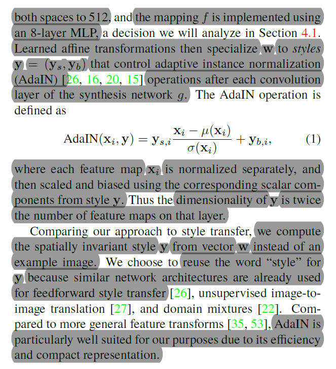

### Style Mixing and Mixing Regularization

In mixing regularization a given percentage of `image are generated from two random latent code` instead of one. 

Two random latent code `z1` and `z2` are passed to mapping network and generate corresponding `w1` and `w2`. When generating these images one latent code is switched with another refered to as `style mixing`.

Figure 3 shows example. If two sets of images from their latent source `A`, `B` are generated then through style mixing attribute of one image set can be passed to the other. In style mixing a subset of style is taken from one source style and rest from another source style. Taking styles of an image with source `B` from coarse spatial resolution `4x4`, `8x8` gives high level aspects such as face shape, hair style, eyeglasses etc. to another image from source `A`. Here, the fine details such as eye, lighting are from source `A` but face shape, hair style, eyeglasses are from source `B`. 

Mixing the styles of middle layers from `16x16`, `32x32` with another source results allows inheriting small scale facial features, eye open closing etc. Mixing style from `64x64` to `1024x1024` allows changing the microstructure, lighting of one source and apply it to the other. 

### Configurations

- Config A is baseline configuration is previous ProGAN with same network, hyperparameters.
- Config B is improved baseline with using bilinear up/down sampling and longer training, tuned hyperparameters.
- Config C adds Mapping Network and AdaIN.
- Config D removes direct latent code input layer in synthesis network and image synthesis instead starts from learned `4x4x512` constant tensor.
- Config E noise inputs are added that are fed after each convolution network after passing though `B`.
- Config F novel mixing regularization that decorrelates neighboring styles and enables more fine grained control over the generated imagery.

### Loss 

- WGAN-GP on CelebA-HQ.
- WGAN-GP on FFHQ with config A.
- `Non saturating loss` with with R1 regularization for config B-F.

## Sampling 

To avoid sampling from extreme regions of intermediate space `W` the `truncation trick` is used. It is mentioned generator allows applying truncation trick selectively at low resolutions only to avoid affecting high resolution details.

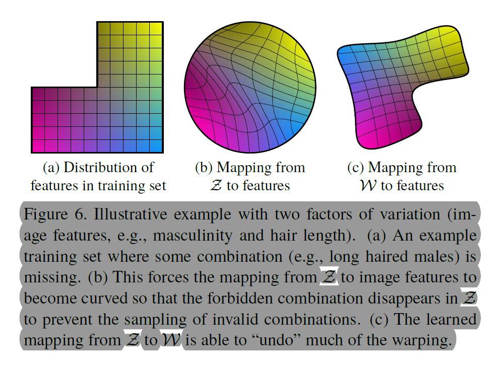

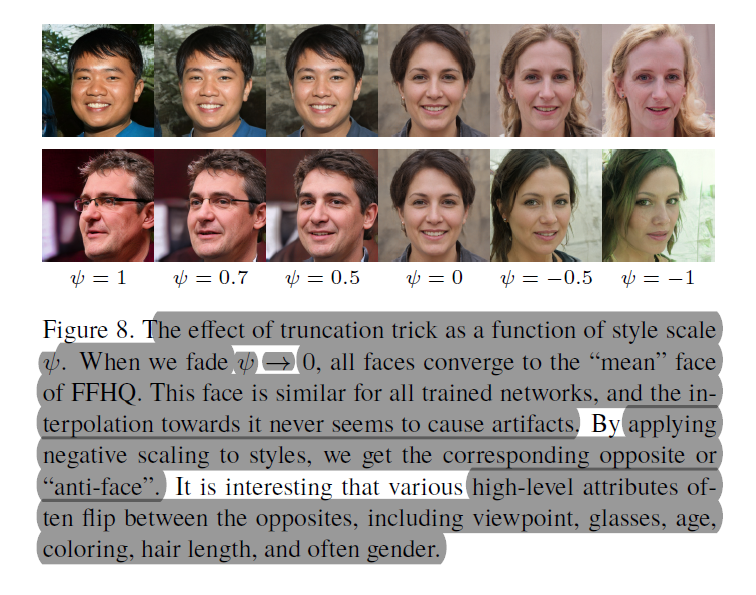

# [StyleGAN 2](https://arxiv.org/abs/1912.04958)

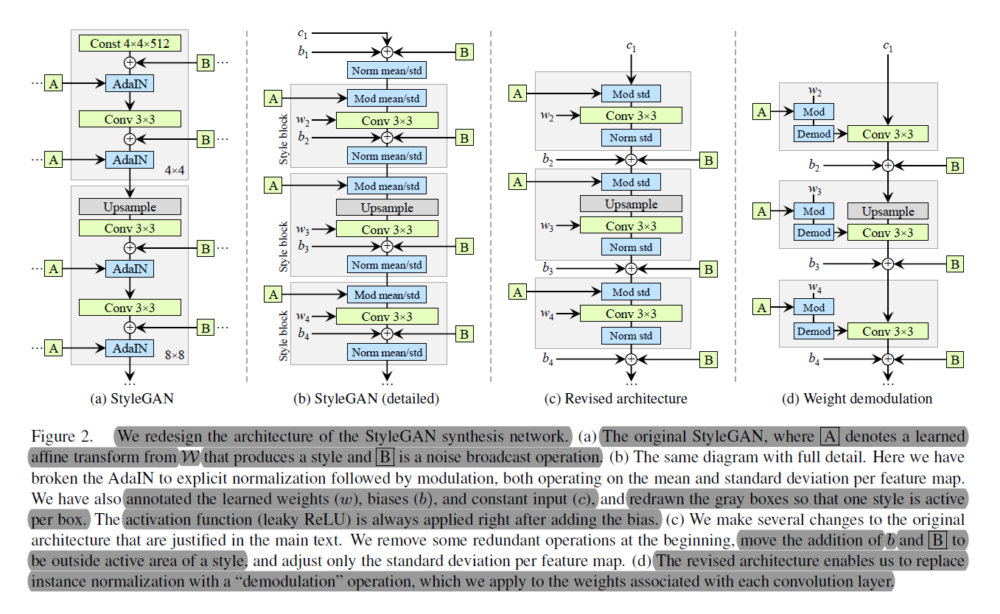

# [StyleGAN 2 ADA](https://arxiv.org/abs/2006.06676)

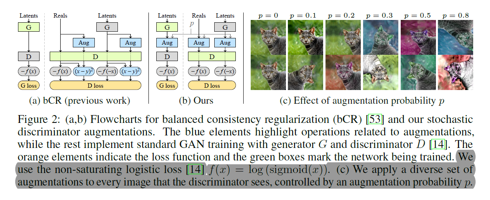

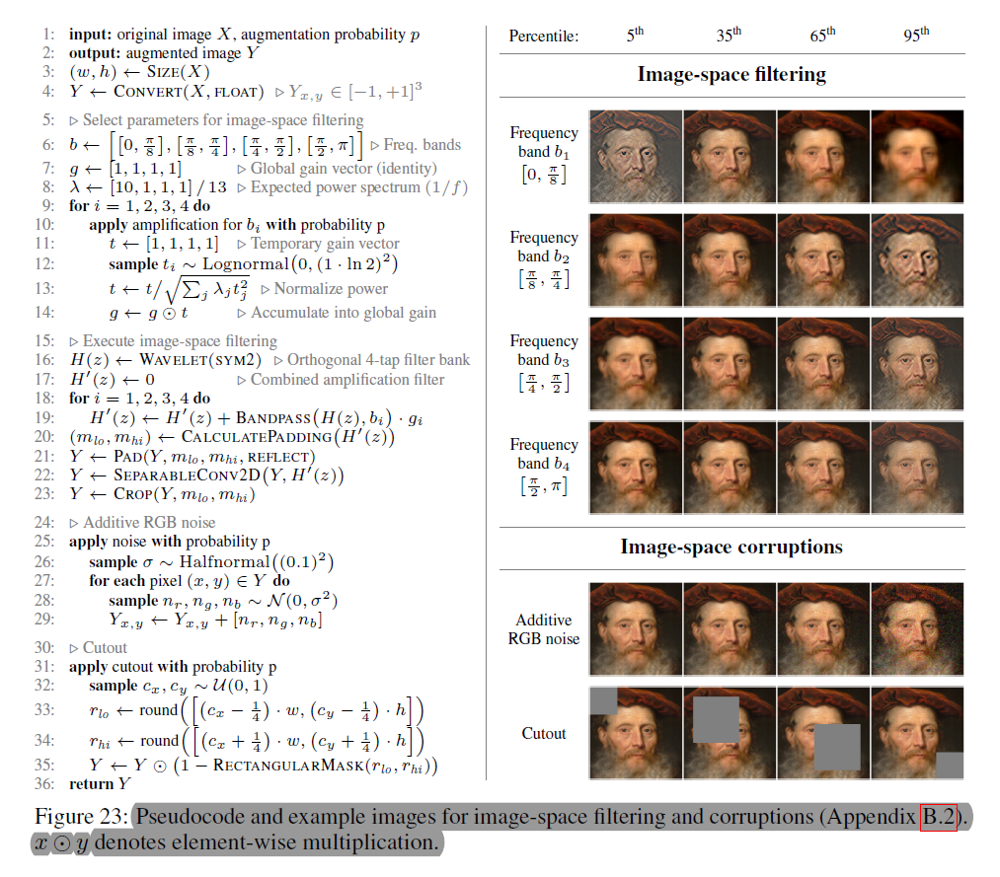

# [StyleGAN 3](https://arxiv.org/abs/2106.12423)

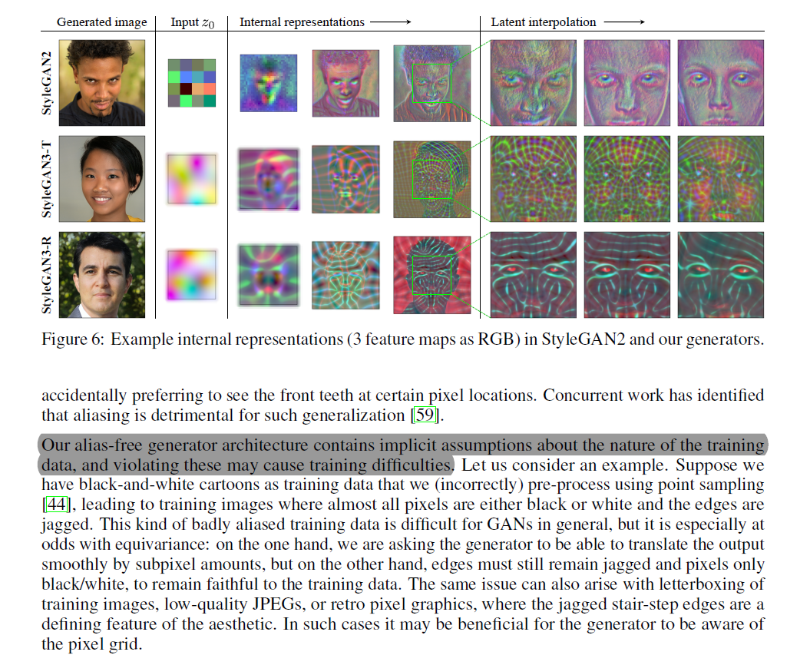

